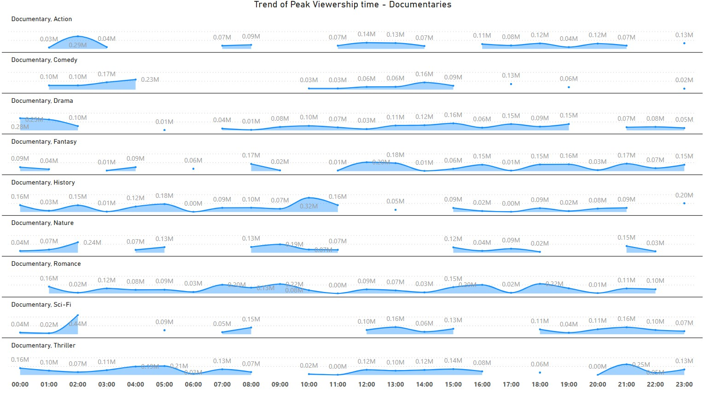
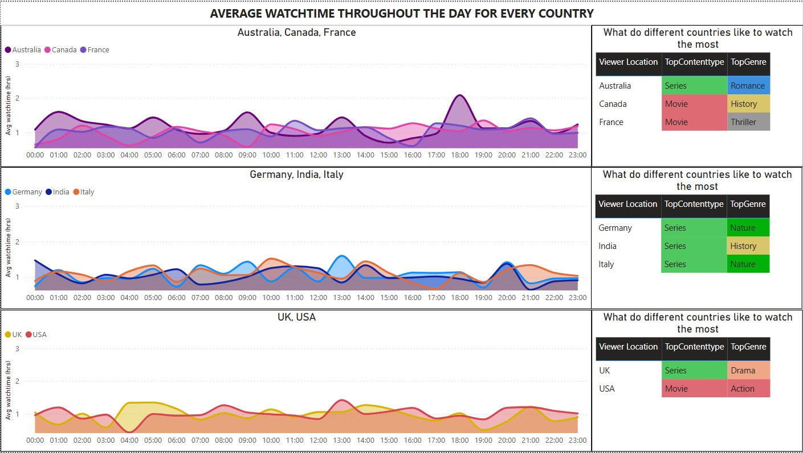

# Content-Scheduling-Analysis

## Using data related to content delivery and viewing habits we identify gaps to optimize content on OTT platforms

### Information
    - Dataset Source - Kaggle
    - Dataset format - Microsoft Excel
    - Tools used - Microsoft Excel and Power BI
    
### Objective
    - Understand range of pricing for each housing category
    - Understand the correlation between area and price for each city and housing category
    - Which one is expensive across different cities - Flat or independent housing
    - Does having a balcony make a house expensive?
    
### Data Cleaning
    - Column corrections - Removing null and errors
    - Column creations - rounding of decimals, creating custom time format columns and average watch times
    
### Process
    - Data hosted on cloud service and connected to give flexibility for data changes
    - Measures created
      - Average completion rate
      - Max and Min Viewership
      - Maximum of average watchtime
      - Top content type
      - Top Genre
      - Created Bins for time of the day periods
            
### Visualizations Created
    - Average watchtime pattern for every country throughout the day
    - What do those countries like to watch
    - Number of releases done by genre throughout the day
    - Viewing patterns of men and women
    - Peak viewership - Deep dive into genre and content type
    - Release vs Peak for all genre
    
    
### Insights
    - Average watchtime is more for Austraila than other countries.
    - Documentaries and Movies are released most during the 1am - 5am time period
    - Average watchtime for women peaks on Tuesday and for mean on Thursday
    - Completion rate is almost similar for all genre for both genders
    - Females prefer more Romance and History related content
    - Men prefer more Thiller and Drama content
    - Thriller movies seem to have the most consistent engagement throughout the day
    - This is closesly followed by Comedy movies.
    - Scifi series offer more consistent engagement than others in the series genre
    - Peak vieweship and release match for movies, while series and documentaries need to match their release with
    - peak viewership

